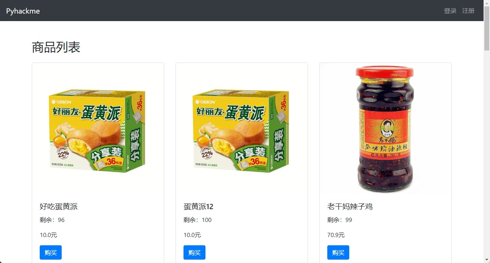

## Pyhackme

[English](readme_en.md)

#### 接近真实世界的web漏洞靶场

> 和市面上大多的web漏洞靶场不同的是，pyhackme更接近于真实的业务场景，每一个漏洞对应的业务场景都是曾经挖过的漏洞的真实写照。

### 靶场漏洞清单

##### 1. 身份认证类漏洞
```buildoutcfg
1. 用户注册：用户注册提示用户已存在，可进行用户枚举（手机号和邮箱作为用户唯一键值）

2. 用户登陆

   2.1 业务系统对登陆失败做了不合理的安全设计，导致账号拒绝服务攻击。

   2.2 业务系统使用了慢散列函数，导致可以通过观察响应时长来枚举用户，SQL注入（盲注）

3. 用户找回密码：找回密码处host注入，导致账号接管

4. 管理员登陆：管理员后台由于没有做登陆失败验证，在2.2的基础上枚举出管理员账户，然后密码暴力破解
```


##### 2. SSRF漏洞
```buildoutcfg
1. 后台批量导入商品：商品的excel文件先传到存储对象，然后服务端发起请求获取该文件进行导入。请求的URL可控，导致SSRF漏洞。
```

##### 3. CSRF漏洞
```buildoutcfg
1. 支付功能：利用他人账号的余额帮自己支付
2. 后台添加账户：添加后台管理员账号
```
##### 4. SQL注入漏洞
```buildoutcfg
1. 用户登陆：布尔盲注
2. 订单详情：联合查询注入
```

##### 5. 条件竞争漏洞
```buildoutcfg
1. 储值卡充值：一张储值卡可以充值多次
```

##### 6. 数据越权漏洞
```buildoutcfg
1. 复购：越权重复购买，消耗他人账户余额
2. 收货人管理
   2.1 越权修改收货人信息
   2.2 越权查看收货人信息
3. 查看订单：越权查看他人订单信息
4. 越权退款：越权退款，导致买家和卖家纠纷，以及其他恶劣影响
```


#### 使用
```buildoutcfg
1. 运行环境：python3+mysql+redis
2. 安装依赖：pip install -r requirements.txt
3. 修改app/config.py配置信息
   3.1 ossak：阿里云accesskey
   3.2 osssk：阿里云secretkey
   3.3 SQLALCHEMY_DATABASE_URI： 数据库连接地址
   3.4 SECRET_KEY：随便设置，不改也行
   3.5 MAIL_SERVER：smtp服务器
   3.6 MAIL_PORT:  端口
   3.7 MAIL_USE_SSL:  是否使用SSL，端口465的话，这里要设置为True
   3.8 MAIL_USERNAME ： 发件人邮箱
   3.9 MAIL_PASSWORD ：发件人邮箱密码，或者客户端smtp token
   3.10 MAIL_DEFAULT_SENDER：和MAIL_USERNAME保持一致
4. 初始化数据库
   4.1 flask db init
   4.2 flask db migrate
   4.3 flask upgrade
5. 启动应用： flask run -h 0.0.0.0
```



have fun!


